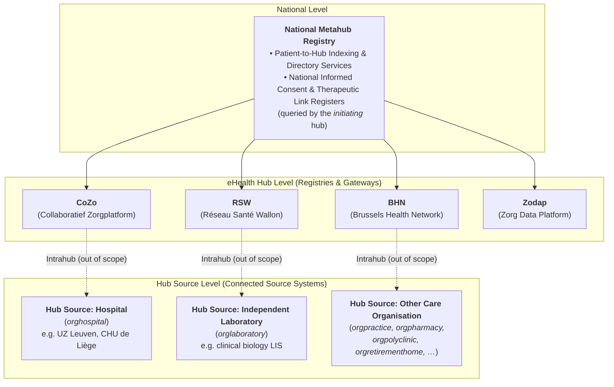
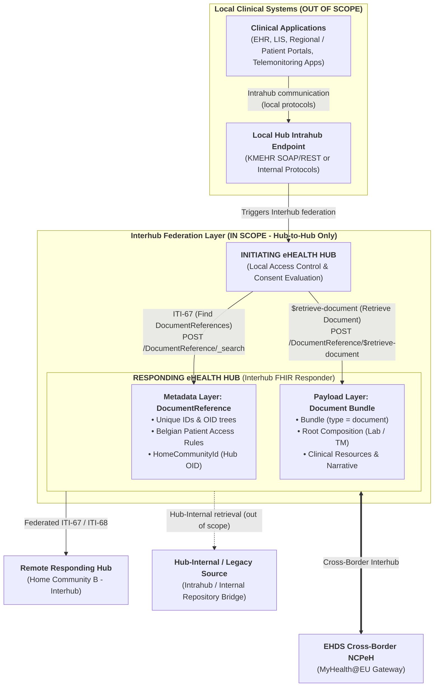
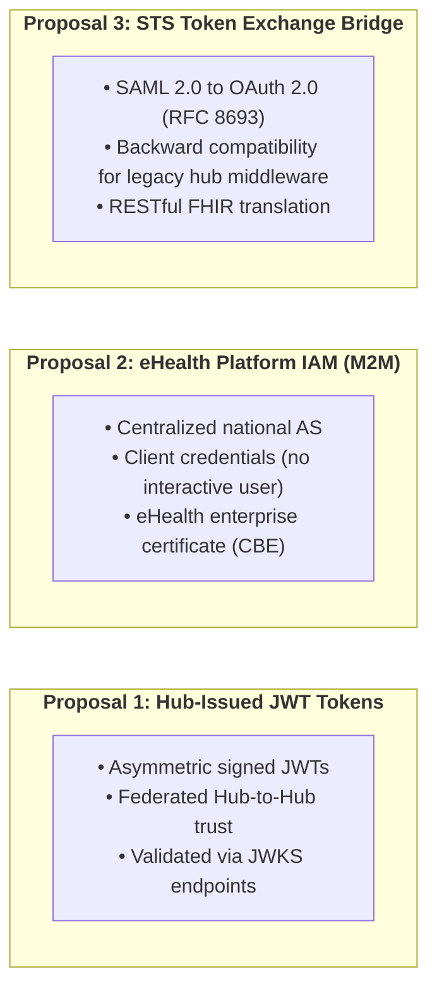

# Belgian Interhub Architecture & Federation Model

> **Where this page sits in the guide** — *Architecture*, page 1 of 2.
> This page is the **map** of the ecosystem; the pages it names are the specification of the individual pieces.
>
> * **Owned by this page:** the metahub / hub / hub source model, what counts as a hub source, federated routing and `homeCommunityId`, and the dual-stack transition gateway.
> * **Summarised here, specified in full elsewhere:** the metadata envelope → [Envelope & Metadata](envelope-and-metadata.html); the two transactions → [Transactions](transactions.html); authentication, tamper-proofing and auditing → [Security & Authentication](security.html); payload encryption → [End-to-End Encryption](end-to-end-encryption.html); the SOAP crosswalk behind the dual-stack gateway → [KMEHR to FHIR Mapping](mapping-kmehr-to-hub.html).
> * **Next:** [Design Rationale](resource-considerations.html) — why this architecture shares FHIR *documents* rather than messages or granular resources.

## The Belgian Federated eHealth Ecosystem

### Hubs and vaults, the latter mentioned in this section only

Healthcare organizations or individual care providers may make their data available to authorized actors either by making these data accessible from their computer systems, or by uploading a copy of the data onto a central location.
In very simplistic terms, the former approach is the one used with the system of the eHealth hubs, while the latter is used with the healthcare 'vaults'.

This is an overly simplistic view because a hub can also opt to store some data on behalf of its partners, but for a hub the primary operation mode is to provide access to data that resides in a care institution, with local storage at the hub more of an exception.
With a vault the data are always managed locally.

For this document, except in the introductory section, the difference between a hub and a vault is irrelevant.
For simplicity and conciseness, this text talks about 'hubs', but vaults or any future system in-between is included as well.

### Intrahub versus interhub communication

For the Belgian eHealth system, the choice was made to not centralize completely.
A first motivation was a matter of principle, that the government should not have excessive control over health data or be able to readily access it.
Thus, the hubs are primarily under control of the working field, be it operating in a highly regulated context.
A second motivation was societal, that there should be sufficient room for separate initiatives to foster progress.

This leads to an architecture in which there can be any number of hubs (even if it was agreed that there must be only one 'formal' vault per political region).
A number of care organizations or other actors arrange amongst them to make their data available, in a health network that is called a hub for largely historical reasons.
There is one metahub that provides basic services (such as management of the citizen's informed consent to this extended data sharing, and enabling the citizen to regulate access) and that enables the hubs to cooperate by keeping track of which hub knows at all about which citizen.

**Fundamental to this architecture is that each hub is free to choose the internal implementation.**
The terms Intrahub and Interhub communication are often used.
Using that wording, Intrahub communication is outside the scope of this guide, as it need not (and must not) be standardized.
With greater nuance:

* The data sources such as the hospitals or clinical laboratories connect to their hub using the Intrahub protocol agreed internally within this health network.
  These actors not only function as a source but also request information from the system.
  They do that using the internally agreed mechanisms as well.
  Broadly speaking, each of such institutions is connected to a single hub, although that is not a formal requirement.
* The hubs cooperate and exchange information between them - in a way that provides a view to the parties that request the information as if there was one single overall system - using the highly standardized Interhub protocol.
  **This Implementation Guide only specifies the FHIR-based Interhub standard for Hub-to-Hub metadata discovery (ITI-67) and document retrieval (ITI-68).**
* Patients or their representatives in practice use any of a number of web portals or mobile apps to access health data or to interact with the system, potentially multiple systems.
  That can be portals or apps provided by a particular hub, or by a commercial actor or the government.
  In the latter situations, the connections to the hubs in the backend are as in the next bullet.
* Healthcare professionals such as general practitioners (or more in general actors in the first line) may use any portal or app just as patients do, but their computer systems typically have a system-to-system connection with a hub of their choice.
  Such connections can be established using the proprietary facilities provided by a particular hub.
  However, for practical or commercial reasons it is often preferred to retrieve information using a protocol that is independent of the hub.
  Therefore, all (most?) hubs enable such retrieval using (a slight variant of) the Interhub protocol.
  The use of this protocol is a deliberate choice.
  The central patient portal [mijngezondheid.be](https://www.mijngezondheid.belgie.be/) / [masante.belgique.be](https://www.masante.belgique.be/) retrieves data from the different hubs using that common protocol.
  Differences between the communication between the hubs and this standard communication with the system of the end user are related to authentication and authorization.
* Similarly, the way in which the end user's computer systems of the previous bullets can be used to enable that user to add information into the system should probably be standardized to a substantial degree, even if that is not formally imposed.
  The current interhub protocol is primarily about data retrieval, though, as is the focus in this text.

Although a system operated by an end user may (essentially) use the Interhub protocol, communication between that system and this hub will not be considered interhub communication.
The term interhub communication is reserved for the communication between the accredited eHealth Hubs, the metahub, and the future Belgian National Contact Point for eHealth (NCPeH) of the EHDS.

### Key Actors & Nodes in the Network

1. **National Metahub**:
   * Acts as a central directory indicating which regional hubs may have information about a particular patient (identified by national **SSIN / INSS**).
   * Holds the national registers of informed consent (IC) and most of the therapeutic links (such as the TR derived from the status of holder of the Global Medical Record - other TRs, notably those with specialist, are managed internally within the hub as sensitive personal medical information can be derived from them).
     These registers are consulted by the **initiating hub** when it performs its own access control, before it emits an Interhub request.
2. **eHealth Hubs**:
   * The primary hubs (or care networks) are **CoZo** (Collaboratief Zorgplatform), **RSW** (Réseau Santé Wallon), **BHN** (Brussels Health Network), and **ZODAP** (ZOrg DAta Platform).
     For the purpose of this text, the eHealth vaults of the Walloon and Brussels region coincide with the hub of those respective regions.
     The Flemish vault is Vitalink.
     FarmaFlux is a secondary hub - for want of a better term - that provides information collected by the community pharmacies (at the time of this writing excluding the pharmacies of the hospitals).
     No end users are directly connected to this hub: it provides these data to the 'primary' hubs.
     * **The list is not closed, and not every node behaves identically.**
       The federation also carries nodes that are not regional document registries in this sense — most notably a **patient-facing vault** (Vitalink), whose content is by definition accessible to the patient and whose request and response conventions differ from a classic hub.
       Hubs also merge and are renamed over time, and a hub that has cached a patient link to a decommissioned hub identifier must still resolve it.
       An Interhub implementation therefore MUST treat the hub list as configuration resolved from the Metahub at runtime, never as a constant compiled into the system, and MUST tolerate a patient link pointing at a hub identifier it does not recognise.
* Each hub acts as a regional Document Registry and Document Gateway, managing indexing and cross-hub routing.
  When a hub *initiates* a query, it is also the actor responsible for access control (see §5).
3. **Data Sources**:
   * For the purpose of this text, these are the source systems, in the technical sense, that share medical data such as medical reports, laboratory results, images or other technical results, results from telemonitoring...
     Within the context of this text it is irrelevant whether the technical system in which the data resides is maintained by the organization or actor that generated the information: that organization or actor can have outsourced operational details.
     This text is not about juridical responsibilities for data quality anyhow.
     As there is freedom in the technical agreements between a hub and its data sources, this text is not to impose any particular architecture.
     That being said, it might be considered to use common principles if the advantages of doing so outweigh the restrictions in local creativity.
     The proposed architecture must not impose a particular approach without very good reasons.
     As an illustration, the architecture preferably should not assume that there is a central index within the hub in which the documents are referenced that are shared by this network.
   * A hub source connects to its regional hub via Intrahub interfaces — whether by publishing documents on a hub, sharing documents via a hub, or exposing its own local registry and repository to the hub.
     It is **any** connected care organisation — not only a hospital (see §1.3).

### What Counts as a Hub Source

A **hub source** is any care organisation whose source system publishes documents on or shares them via a hub (or exposes its local registry and repository to the hub) and answers retrievals from it.
Hospitals are one example among many; the KMEHR `CD-HCPARTY` organisation types give the real range.

| Code | Organisation type | Code | Organisation type |
| :--- | :--- | :--- | :--- |
| `orghospital` | Hospital | `orgprevention` | Prevention organisation |
| `orglaboratory` | Independent laboratory | `orgprimaryhealthcarecenter` | Primary health care center |
| `orgpharmacy` | Independent pharmacy | `orgpsychiatriccarehome` | Psychiatric care home |
| `orgpharmacyinvoicingoffice` | Pharmacy invoicing office | `orgpublichealth` | Public health organisation |
| `orgpolyclinic` | Polyclinic | `orgretirementhome` | Retirement home |
| `orgpractice` | Practice organisation | `orgrevalidationcenter` | Revalidation center |
| `orginsurance` | Insurance | `orgshelteredliving` | Sheltered living |

Throughout this implementation guide, **"hub source"** designates this entire class of systems.
Where a hospital, a laboratory or a retirement home is named, it is only ever an *example* of a hub source, never a restriction of the model.
The `CD-HCPARTY` codes themselves — and every other KMEHR code table — are crosswalked to FHIR in [KMEHR to FHIR Mapping](mapping-kmehr-to-hub.html#3-code-system--value-set-crosswalks).

---

## Evolution: From SOAP KMEHR to RESTful FHIR MHD

Historically, Interhub communication was specified using SOAP Web Services exchanging XML payloads conforming to Belgian **KMEHR** schemas (`getTransactionList`, `getTransaction`, `putTransaction`, `getTransactionAccessList`).

In contrast, the updated Interhub specification in this document proposes **IHE MHD (Mobile access to Health Documents)** on **HL7® FHIR® R4**, in a RESTful approach:

The diagram shows the *shape* of the exchange only: the clinical applications communicate exclusively with their local Hub via Intrahub protocols (out of scope), and the local Hub initiates Interhub transactions across the federation.
Each layer of the Interhub specification is detailed on its own page: the **metadata layer** element by element in [Envelope & Metadata](envelope-and-metadata.html#2-element-by-element-specification-beinterhubdocumentreference), the **two transactions** (ITI-67 / ITI-68) in [Transactions](transactions.html), the **cross-border branch** in [EHDS Alignment](ehds-alignment.html), and the reasoning behind carrying payloads as document bundles at all in [Design Rationale](resource-considerations.html#2-evaluation-of-candidate-carrier-paradigms).

---

## Cross-Hub Routing & Identifiers

In a cross-hub exchange, an **initiating hub** queries for the availability of information or retrieves information from a **responding hub**.
The initiating hub has performed most of the access control checks and the responding can (and for some checks needs) to trust the initiating hub (see §5).

What governs the routing itself is a set of standardized identifiers registered in the Belgian eHealth OID tree (`1.3.6.1.4.1.21297`):

### Belgian National Identifiers

| Concept | URI / System | OID Root | Description & Syntax Example |
| :--- | :--- | :--- | :--- |
| **Patient SSIN / INSS** | `https://www.ehealth.fgov.be/standards/fhir/core/NamingSystem/ssin` | `1.3.6.1.4.1.21297.100.1.1` | National Social Security Identification Number (e.g. `79080412345`). |
| **Practitioner NIHDI / RIZIV** | `https://www.ehealth.fgov.be/standards/fhir/core/NamingSystem/nihdi` | `1.3.6.1.4.1.21297.100.9.1` | Healthcare professional license number (11 digits, e.g. `19876543201`). |
| **Care Organisation / Facility NIHDI** | `https://www.ehealth.fgov.be/standards/fhir/core/NamingSystem/nihdi` | `1.3.6.1.4.1.21297.100.11.1` | Healthcare institution accreditation number (8 digits, e.g. `71000012`). |
| **Enterprise CBE / KBO** | `https://www.ehealth.fgov.be/standards/fhir/core/NamingSystem/cbe` | `1.3.6.1.4.1.21297.100.11.2` | Crossroads Bank for Enterprises business number (10 digits, e.g. `0419052173`). |
| **Hub eHealth Platform (EHP) number** | `https://www.ehealth.fgov.be/standards/fhir/core/NamingSystem/ehp` | — | **The identifier by which a hub is actually addressed today**: a `1990……` number carried as `hcparty/id[@S="ID-HCPARTY"]` next to `cd[@S="CD-HCPARTY"] = "hub"`, returned by the Metahub patient-link register, and asserted in the hub's eHealth security token. |
| **Hub Home Community ID** | `urn:ietf:rfc:3986` | `1.3.6.1.4.1.21297.1.X` | URN OID identifying the regional hub (e.g. `urn:oid:1.3.6.1.4.1.21297.1.3` for CoZo). Assigned by this IG **in addition to** the EHP number above, and registered against it — see the note below. |
| **Repository Unique ID** | `urn:ietf:rfc:3986` | `1.3.6.1.4.1.21297.100.2.X` | Identifies the physical document storage repository within a hub network. |
| **CD-TRANSACTION** | `https://www.ehealth.fgov.be/standards/fhir/core/CodeSystem/cd-transaction` | `1.3.6.1.4.1.21297.100.3.1` | Document category coding system (e.g. `sumehr`, `labresult`, `telemonitoring`). |

These identifiers are bound to concrete `BeInterhubDocumentReference` elements in [Envelope & Metadata](envelope-and-metadata.html#2-element-by-element-specification-beinterhubdocumentreference), and to their legacy KMEHR / IHE XDS.b counterparts in [KMEHR to FHIR Mapping](mapping-kmehr-to-hub.html#2-master-metadata-mapping-matrix).

> **Two identifiers for one hub, and the older one is the one in production.**
> Introducing `homeCommunityId` OIDs is the right move for IHE and EHDS alignment, but nothing in the existing ecosystem knows them: hub routing tables, the Metahub patient-link register and the hub's own security token all speak **EHP numbers**.
> This IG therefore requires that every hub OID be registered against the hub's EHP number, that a responding hub be able to answer routing on either, and that `extension[homeCommunityId]` accept both forms ([Envelope & Metadata §3.1](envelope-and-metadata.html#31-home-community-id-beexthomecommunityid)).
> Publishing an OID that cannot be resolved back to an EHP number would make a `DocumentReference` unroutable by every hub in service today.

### Routing Mechanics via `homeCommunityId`

1. **Discovery (`getTransactionList` / ITI-67)**:
   * The initiating hub retrieves the patient links made available by the metahub and queries each of the eHealth Hubs for the list.
   * Every returned `BeInterhubDocumentReference` contains the mandatory extension `homeCommunityId` (e.g. `urn:oid:1.3.6.1.4.1.21297.1.3`).
2. **Retrieval (`getTransaction` / ITI-68)**:
   * The initiating hub inspects `DocumentReference.content.attachment.url` and `homeCommunityId` to dispatch the retrieval request directly to the authoritative responding hub repository hosting the document bundle.

The query syntax for step 1 and the retrieval call for step 2 are specified in [Transactions](transactions.html#2-transaction-1-gettransactionlist-mhd-iti-67-find-documentreferences); the `homeCommunityId` extension itself in [Envelope & Metadata](envelope-and-metadata.html#31-home-community-id-beexthomecommunityid).

---

## Dual-Stack Gateway Architecture during the Transition Phase

The hubs do not consider temporarily suspending their societal role while their architecture is upgraded.
Besides, some KMEHR connectors in clinical production systems are expected to outlive this very version of the specification that makes them outdated.
At least the 'primary' hubs (see §1.3 for this informally used term) will install a **dual-stack mediation gateway** that can handle both protocols:

* **Legacy KMEHR Interhub / Intrahub → Modern FHIR Hub**: The gateway receives SOAP `getTransactionList` or `getTransaction` requests, queries the internal FHIR registry/repository via MHD ITI-67 / ITI-68, and transforms the resulting `DocumentReference` and `Bundle (type=document)` back into KMEHR `TransactionSummaryType` or `FolderType` XML.
* **Modern FHIR Initiating Hub → Legacy Hub Source / Legacy Responding Hub**: The gateway accepts RESTful POST searches and document retrieval requests, translates them into SOAP KMEHR Web Service calls to legacy systems, transforms the returned KMEHR XML / attachments into standardized FHIR Document Bundles, and returns them over Interhub.

The field-by-field transformation rules the gateway applies in both directions — including how a FHIR Document Bundle is encapsulated inside a KMEHR `<lnk>` element during the transition — are specified in [KMEHR to FHIR Mapping](mapping-kmehr-to-hub.html#4-encapsulation-strategy-fhir-document-inside-kmehr-transition-phase).

---

## Trust Model, Security Architecture & Connection Routes (Proposal)

> **This section is a summary.**
> The normative security specification — the three routes in full, DPoP / RFC 9421 tamper-proofing, the initiating/responding responsibility split, and IHE BALP auditing — is on the [Security & Authentication](security.html) page and takes precedence over the overview below.

### Trust Model Between the Initiating and Responding Hubs in Interhub Communication

The hubs established amongst them a set of rules about security in interhub communication.
(Disclaimer: Vitalink has suggested that it may not want to adhere to all of these rules.)
As mentioned previously in this chapter, in interhub communication there is an initiating and a responding hub.
A hub never engages in 'medical communication' with another hub on its own initiative, as the hub is not itself a healthcare organization that provides care to patients, and thus has no reason to access any patient's medical data.
Currently, some hubs retrieve data sets from the metahub for their internal operations, such as the updates to the list of patients who provided their IC, but for technical reasons only (in this case, to not have to inquire the existence of the IC at run time).
With future projects, more of such purely technical communication might emerge, though probably still very limited.

* At the time of this writing, the hubs always expect the responsible healthcare provider to be provided in each request.
  If this physical person is affiliated to an organization, for the current request, that organization is provided as well.
  For this technical document there is no need to precisely define the term 'responsible'.
  It could be considered that in future applications the organization itself becomes responsible for some of the retrievals, as there is no notion of the physical person behind the computer screen (or the care provider who is looking over the shoulders of the person behind the keyboard), but such would be decided at national level, not at the discretion of any individual hub.
* The **initiating hub** performs or checks authentication and the role of the end user and/or the organization.
  It may rely for that on systems provided by the government or on internal systems.
  The government may propose or even impose particular authentication mechanisms.
  The concept of the CoT (Circle of Trust) was introduced because authentication mechanisms that may make sense in a telematics setting may not be feasible within a physically enclosed setting such as a hospital, or even risk to lower security in such a setting.
* The initiating hub also performs most of the checks for access control, at the time of this writing whether the patient has provided the IC for data sharing through this system, whether there is sufficient proof of a therapeutic relation (TR), and whether the user has not been excluded from access by the patient.
  Some of the information for those checks is only available to this hub and is not available in another component of the eHealth ecosystem, often because of societal considerations.
  The initiating hub does not currently decide what information the user is entitled to see: that is done by the responding hub, as that hub has the detailed information needed for that operation.
  (It has been proposed that the initiating hub provide to the responding hub the indicated access, though, in part for practical reasons).
* The **responding hub** could perform some of the checks that the initiating hub performed, but is not required to do so.
  This hub has to trust the initiating hub anyhow, as some checks can only be performed by the latter.
  The responding hub is responsible for detailed filtering of the information, though, potentially delegating that to the Data Source.
  Furthermore it must perform technical validation (including such aspects as authentication of the initiating hub, replay/tamper-proofing, and query syntax checking) and write an entry into its audit trail.

### Connection Routes

Three distinct connection routes are on the table for authenticating the calling hub.

> **Important Architectural Note**: The three connection models presented below represent an **architectural proposal**.
> The final Belgian Interhub standard will **select and mandate one of these three methods** as the unified national authentication framework.

1. **Route 1: Hub/Enterprise-Issued JWTs**: Direct peer-to-peer trust federation between regional hubs using asymmetric signed JWT bearer tokens validated against public JWKS endpoints.
2. **Route 2: eHealth Platform IAM (machine-to-machine)**: Centralized authentication of the calling hub through the national eHealth IAM using the **OAuth 2.0 client credentials** grant and the hub's **eHealth enterprise certificate**.
   Interhub is system-to-system traffic, so this route involves **no eID or itsme® authentication**: the token identifies the calling hub organisation (CBE / hub OID), and practitioner details travel only as audit claims.
3. **Route 3: STS Token Exchange Bridge**: Seamless backward compatibility bridge translating legacy SOAP WS-Trust / SAML 2.0 assertions from the eHealth STS into short-lived OAuth 2.0 JWTs (RFC 8693).

Whichever route is chosen, the legacy SOAP SAML request signature still needs a successor.
All three routes are therefore evaluated together with **DPoP (RFC 9449)** and **RFC 9421 (HTTP Message Signatures)**, which close off replay and query-parameter manipulation in the RESTful world.

For complete technical specifications, see **[Security & Authentication](security.html)** (normative) and the **[End-to-End Encryption](end-to-end-encryption.html)** discussion paper (non-normative).

---

## Continue reading

* **Next:** [Design Rationale](resource-considerations.html) — why Interhub shares `Bundle.type = #document` payloads discovered through a `DocumentReference` envelope.
* **Then, in order:** [Envelope & Metadata](envelope-and-metadata.html) → [Transactions](transactions.html) → [Security & Authentication](security.html) → [End-to-End Encryption](end-to-end-encryption.html).
* **Related:** [KMEHR to FHIR Mapping](mapping-kmehr-to-hub.html) for the dual-stack gateway crosswalk (§4 above), [EHDS Alignment](ehds-alignment.html) for how this federation is presented to MyHealth@EU.
