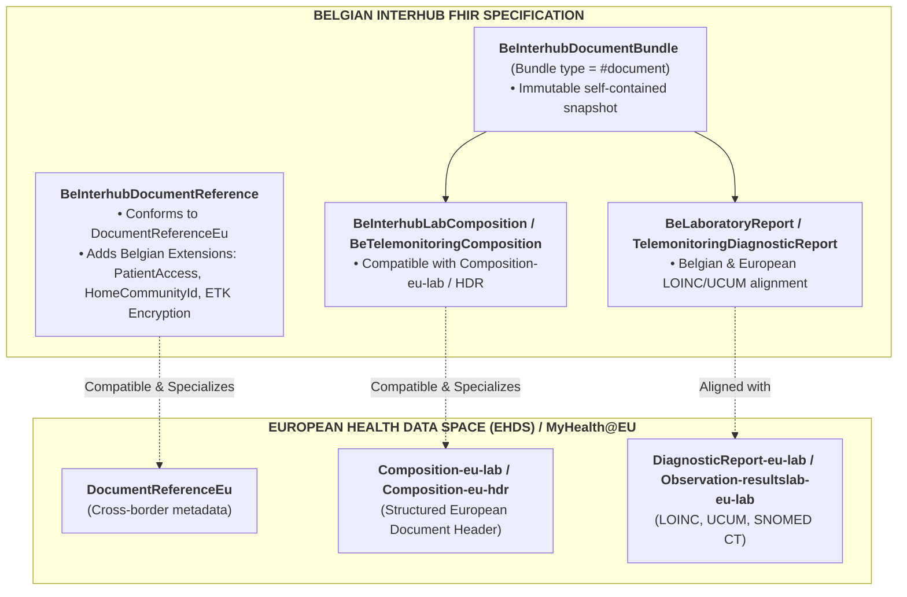
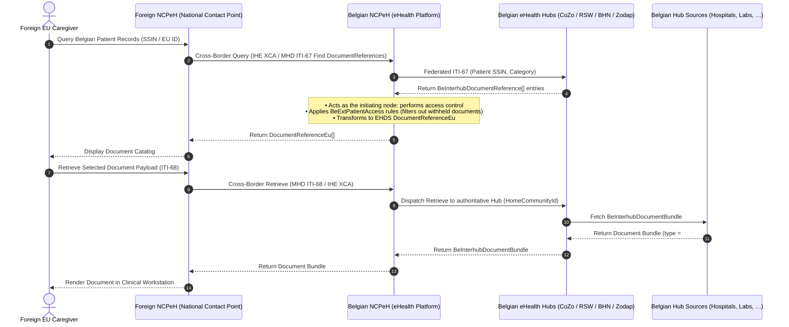

# European Health Data Space (EHDS) Alignment & Interoperability

> **Where this page sits in the guide** — *Migration & Alignment*, page 2 of 2. It looks outward: how everything specified earlier in this guide maps onto European cross-border exchange.
>
> * **Owned by this page:** the Belgian ↔ EHDS profile alignment matrix, the Belgian capabilities that go beyond baseline EHDS, and the MyHealth@EU gateway translation flow.
> * **Assumes:** [Envelope & Metadata](envelope-and-metadata.html) (the extensions compared here) and [Laboratory Reports](lab-report-sharing.html) (the EU lab document type).
> * **Previous:** [KMEHR to FHIR Mapping](mapping-kmehr-to-hub.html) · **Next:** [Artifacts](artifacts.html) — the machine-readable profiles, extensions and examples behind every page of this guide.

## 1. Context & Strategic Alignment

The **European Health Data Space (EHDS)** regulation lays down common standards, technical architectures and interoperability profiles for the cross-border primary use of health data between EU Member States, delivered through **MyHealth@EU / eHDSI**. The European Commission and HL7 Europe have named a set of priority clinical domains:
* **Laboratory Results (EU Lab)**: Laboratory test reports, panels, observations, and specimens.
* **Hospital Discharge Reports (EU HDR)**: Episode summaries and hospitalization reports.
* **Patient Summaries (EU PS)**: Core longitudinal health summaries.
* **Medical Imaging Studies (EU Imaging / MADO)**: DICOM manifest studies and imaging reports.
* **ePrescription & eDispensation (EU eP/eD)**: Pharmaceutical prescriptions and dispensing records.

Belgian Interhub modernization is bound by a firm requirement: **strict alignment and semantic compatibility with the EHDS profiles**, without giving up the governance, federated routing and privacy controls the Belgian system already has — that is, the extensions specified in [Envelope & Metadata §3](envelope-and-metadata.html#3-belgian-extensions-deep-dive) and the federation model described in [Architecture](architecture.html).

---

## 2. Structural Alignment: Belgian Interhub vs. EHDS Profiles

### 2.1 Profile Alignment Matrix

| EHDS Profile / Element | Belgian Interhub Profile / Element | Interoperability & Conformance Notes |
| :--- | :--- | :--- |
| **`DocumentReferenceEu`** | **`BeInterhubDocumentReference`** | `BeInterhubDocumentReference` satisfies all mandatory elements of `DocumentReferenceEu` (subject, status, type, category, date, author, attachment) while conforming to `IHE.MHD.Comprehensive.DocumentReference`. It embeds contained resources and adds Belgian-specific extensions for `homeCommunityId`, `patientAccess`, and `recordDateTime`. |
| **`Composition-eu-lab`** | **`BeInterhubLabComposition`** | Both profiles require LOINC `11502-2` ("Laboratory report"), mandatory patient subject, author attribution, and structured narrative sections containing laboratory observation entries. |
| **`DiagnosticReport-eu-lab`** | **`BeLaboratoryReport`** (HL7 Belgium) | Sliced category containing `v2-0074#LAB`, mandatory `code`, `performer`, `issued`, and referenced `Observation` and `Specimen` resources. |
| **`Observation-resultslab-eu-lab`** | **`BeObservationLaboratory`** / Core Observation | Standard LOINC test coding, UCUM unit representation, and reference ranges. |
| **`Document Bundle (type = document)`** | **`BeInterhubDocumentBundle`** | Both architectures mandate that structured documents are exchanged as **self-contained FHIR Bundles of type `document`**, rooted by a `Composition`. |

---

## 3. Belgian Advancements Beyond Baseline EHDS

Belgium carries several capabilities that the European baseline does not require, each of them driven by day-to-day care delivery rather than by cross-border exchange. None of them breaks downstream compatibility:

### 3.1 Federated Multi-Hub Routing (`homeCommunityId`)
* **EHDS**: Typically models exchanges through a single National Contact Point for eHealth (NCPeH) per Member State.
* **Belgium**: Operates a federated multi-hub network (CoZo, RSW, BHN, Zodap, Metahub). The Belgian profile incorporates `BeExtHomeCommunityId` and `repositoryUniqueId` to support distributed multi-hub queries, deduplication, and direct peer-to-peer document retrieval.

### 3.2 Granular Patient Access Governance (`BeExtPatientAccess`)
* **EHDS**: Patient access is generally handled out-of-band at the portal level.
* **Belgium**: Metadata explicitly encodes patient portal visibility permissions (`yes`, `no`, `never`), release delay dates (`accessDate`), and clinical withholding justifications (`deniedReason`), enforcing Belgian patient rights legislation directly within the metadata layer.

### 3.3 End-to-End Application Encryption (ETEE / ETK Depot)
* **EHDS**: Primarily relies on transport-layer security (TLS) between gateways.
* **Belgium**: Supports payload-level end-to-end encryption using the recipient's public key from the national eHealth ETK Depot (`BeExtEndToEndEncryption`), ensuring document confidentiality across untrusted intermediaries. This capability is precisely where Belgian and European models pull apart: encrypted payloads cannot be mediated by a National Contact Point, which is why this IG recommends restricting it to a sealed-records tier — see [End-to-End Encryption §5](end-to-end-encryption.html#5-recommended-strategic-solution-the-tiered-hybrid-architecture).

### 3.4 Strict Document Typing (`Bundle.type = #document`)
* **EHDS**: Allows various exchange modalities (FHIR documents, RESTful searches on individual resources, CDA XML).
* **Belgium**: Standardizes Interhub sharing strictly on **FHIR Bundles of type `document`** (`MHD ITI-68`), ensuring complete clinical immutability, attestability, and ease of archiving.

---

## 4. Cross-Border Gateway Translation (MyHealth@EU and Belgian Hubs)

The flow below traces what happens when a healthcare provider elsewhere in Europe queries a Belgian patient's records through MyHealth@EU:

1. The Belgian NCPeH receives the cross-border query and, acting as the **initiating hub** inside the Belgian network, performs its access control (consent and cross-border eligibility) before running an Interhub `getTransactionList` (MHD ITI-67) search across Belgian eHealth hubs. The responding Belgian hubs trust the NCPeH and do not repeat those checks.
2. The regional hubs return `BeInterhubDocumentReference` entries.
3. The Belgian NCPeH filters out documents marked `PatientAccess = never` or sealed, strips internal Belgian-only routing extensions if necessary, and serves the compliant `BeInterhubDocumentBundle` payload to the foreign healthcare provider.

In Interhub terms the NCPeH is simply another **initiating hub**: it performs the access control and the Belgian hubs answer on trust, exactly as specified in [Security & Authentication §1.1](security.html#11-trust-model-access-control-is-the-initiating-hubs-responsibility). The two calls it makes are the ordinary ITI-67 and ITI-68 transactions of [Transactions](transactions.html), and the access flags it filters on are specified in [Envelope & Metadata §3.2](envelope-and-metadata.html#32-belgian-patient-access-metadata-beextpatientaccess).

---

## Continue reading

* **Previous:** [KMEHR to FHIR Mapping](mapping-kmehr-to-hub.html) — the inward-facing migration crosswalk.
* **Next:** [Artifacts](artifacts.html) — the profiles, extensions, value sets, capability statements and examples referenced throughout this guide.
* **Related:** [Envelope & Metadata](envelope-and-metadata.html) for the Belgian extensions compared in §3; [End-to-End Encryption](end-to-end-encryption.html) for why payload encryption complicates cross-border exchange; [Laboratory Reports](lab-report-sharing.html) for the EU lab document type in practice.
