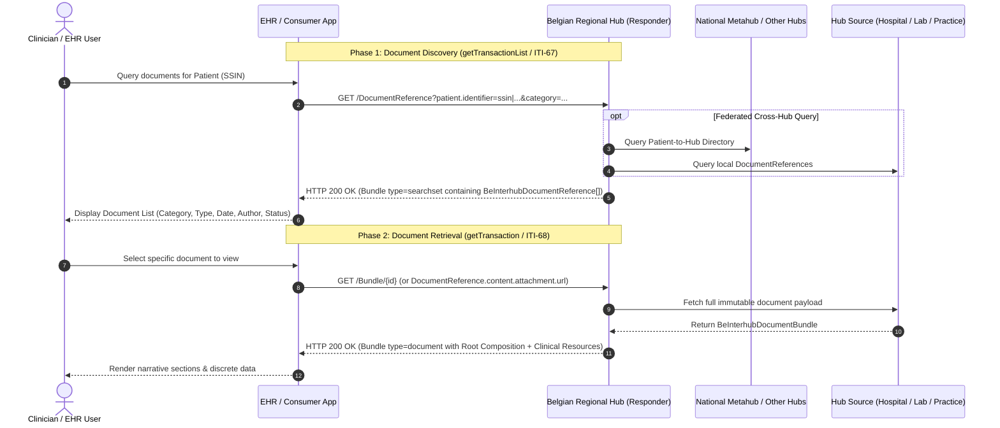
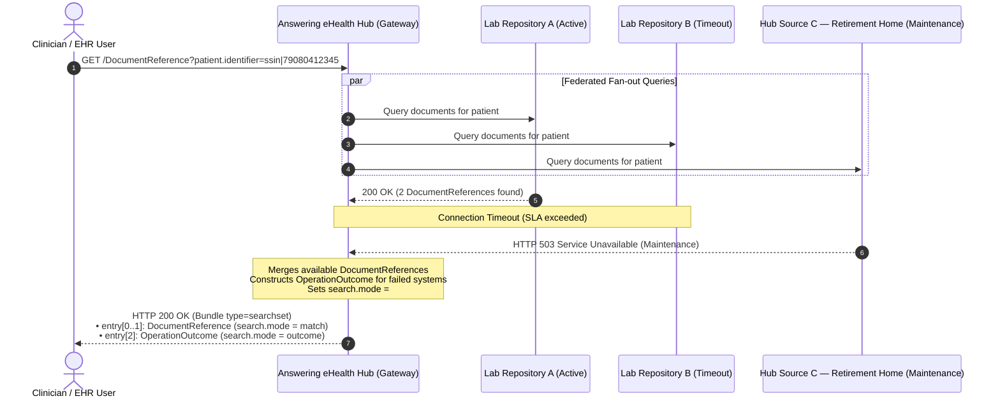
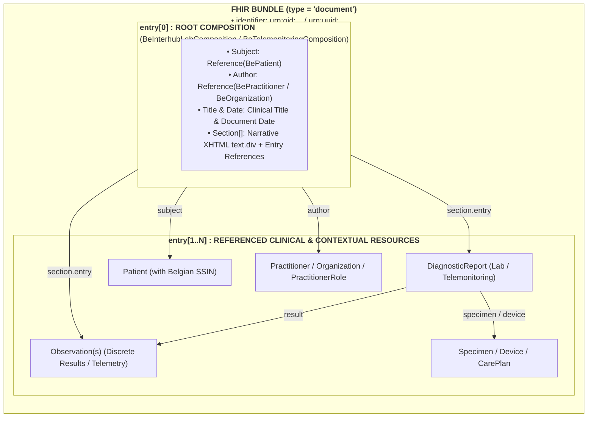

# Interhub Transactions: getTransactionList & getTransaction

> **Where this page sits in the guide** — *Specification*, page 2 of 4. This page is the **wire-level contract**: URLs, parameters, status codes and response shapes.
>
> * **Owned by this page:** `getTransactionList` (ITI-67), `getTransaction` (ITI-68), partial-failure `OperationOutcome` handling, and the error-code crosswalk.
> * **Not covered here:** the fields of the `DocumentReference` returned by ITI-67 → [Envelope & Metadata](envelope-and-metadata.html); how the calling hub is authenticated and the request is tamper-proofed → [Security & Authentication](security.html); what a real payload looks like per domain → [Laboratory Reports](lab-report-sharing.html) and [Telemonitoring](mapping-telemonitoring-to-hub.html); why the payload is a document bundle at all → [Design Rationale](resource-considerations.html).
> * **Previous:** [Envelope & Metadata](envelope-and-metadata.html) · **Next:** [Security & Authentication](security.html)

## 1. Overview of Interhub Transactions

The Belgian federated hub architecture relies on two core document-sharing interactions:
1. **Document Discovery (`getTransactionList`)**: Enables an EHR, clinical portal, or initiating hub to discover available clinical documents for a patient across all connected regional hubs.
2. **Document Retrieval (`getTransaction`)**: Enables a consumer to retrieve the complete, immutable clinical document payload for a specific transaction.

In the modernized FHIR-based Belgian Interhub standard, these legacy SOAP operations are mapped directly to the **IHE MHD (Mobile access to Health Documents)** profile family on **HL7® FHIR® R4**:

| Legacy KMEHR SOAP Operation | Target IHE MHD / FHIR Transaction | Target Resource / Action | Payload Returned |
| :--- | :--- | :--- | :--- |
| **`getTransactionList`** | **MHD ITI-67** (`Find DocumentReferences`) | `GET [base]/DocumentReference` (RESTful Search) | `Bundle` (type = `searchset`) containing `BeInterhubDocumentReference` entries |
| **`getTransaction`** | **MHD ITI-68** (`Retrieve Document`) / `$document` | `GET [base]/Bundle/[id]` or `GET [base]/Composition/[id]/$document` | Complete `BeInterhubDocumentBundle` (type = `document`) |
| **`getTransactionSet`** | **MHD ITI-68** with content negotiation | `GET [base]/Bundle/[id]` with `Accept: application/pdf`, or the `content[]` entry advertising `application/pdf` | The same document, either as a set of related transactions or as a hub-rendered PDF — see [§3.4](#34-transaction-sets-and-rendered-pdf-gettransactionset) |

The resource returned by ITI-67 is specified field by field in [Envelope & Metadata](envelope-and-metadata.html#2-element-by-element-specification-beinterhubdocumentreference). The resource returned by ITI-68 is a `BeInterhubDocumentBundle`, whose per-domain content is specified in [Laboratory Reports](lab-report-sharing.html) and [Telemonitoring](mapping-telemonitoring-to-hub.html). The legacy SOAP operations in the left-hand column are crosswalked in [KMEHR to FHIR Mapping](mapping-kmehr-to-hub.html).



---

## 2. Transaction 1: `getTransactionList` (MHD ITI-67 `Find DocumentReferences`)

### 2.1 Trigger & Scope
A healthcare professional, clinical application, or regional gateway initiates this transaction to query for health documents available for a patient identified by their Belgian **SSIN / INSS**.

The **initiating hub** performs its access control before emitting this transaction (e.g. by checking the Metahub for an informed consent / therapeutic link, or by consulting its own local database). The answering hub authenticates the calling hub, trusts it, and answers the query. This trust model is only summarised here; it is specified in full — together with the responsibility split between the two hubs — in [Security & Authentication §1.1](security.html#11-trust-model-access-control-is-the-initiating-hubs-responsibility).

### 2.2 HTTP Interaction & Query Parameters

```http
GET [base]/DocumentReference?patient.identifier=https://www.ehealth.fgov.be/standards/fhir/core/NamingSystem/ssin|79080412345&category=https://www.ehealth.fgov.be/standards/fhir/core/CodeSystem/cd-transaction|labresult&date=ge2026-01-01T00:00:00Z&date=le2026-12-31T23:59:59Z&status=current&_count=50 HTTP/1.1
Host: hub.cozo.be
Accept: application/fhir+json
Authorization: Bearer <calling-hub-authentication-token>
```

The `Authorization: Bearer` token above is obtained through one of the three connection routes specified in [Security & Authentication §2](security.html#2-the-three-authentication--connection-routes-proposal); every request additionally carries DPoP or RFC 9421 tamper-proofing headers ([§3](security.html#3-replay-attack-prevention--query-tamper-proofing-dpop-rfc-9449--rfc-9421)).

#### Supported Search Parameters:

| FHIR Search Parameter | Syntax & Modifier | KMEHR Concept | Description |
| :--- | :--- | :--- | :--- |
| **`patient.identifier`** *(Mandatory)* | `token` (`system\|value`) | `folder/patient/id[@S="INSS"]` | Patient's national Social Security Identification Number (SSIN). Systems must support both `https://www.ehealth.fgov.be/standards/fhir/core/NamingSystem/ssin` and `urn:oid:1.3.6.1.4.1.21297.100.1.1`. |
| **`category`** *(Optional)* | `token` (`system\|code`) | `transaction/cd[@S="CD-TRANSACTION"]`, and any `transaction/cd[@S="LOCAL"]` | Filters by Belgian document category (e.g. `sumehr`, `labresult`, `discharge`, `telemonitoring`). A hub matches on **any** coding present in the `CodeableConcept`, national or local ([Envelope & Metadata §4.2](envelope-and-metadata.html#42-multiple-codings-national-and-local-codes-for-the-same-concept)). |
| **`type`** *(Optional)* | `token` (`system\|code`) | *derived* — see note below | Filters by clinical LOINC code (e.g. `http://loinc.org\|11502-2` for Lab Report, `http://loinc.org\|18754-2` for Holter Study). A KMEHR hub transaction is not natively typed with LOINC; the responding hub derives the coding from `CD-TRANSACTION` and the local `cd`, so a hub that cannot derive one returns no match rather than a wrong one. |
| **`date`** *(Optional)* | `date` (`ge`, `le`, `gt`, `lt`) | `transaction/date` + `transaction/time`, mapped onto `select/transaction/begindate` & `enddate` | Filters on the **document** date/time, not on when the hub indexed it. The legacy `select/transaction/begindate`/`enddate` filter is date-granular; a hub that can only filter by whole days MUST widen the range and filter the remainder itself rather than dropping matches. |
| **`author.identifier`** *(Optional)* | `token` (`system\|value`) | `transaction/author/hcparty/id` | Filters by authoring physician NIHDI (`1.3.6.1.4.1.21297.100.9.1`) or institution NIHDI (`100.11.1`). |
| **`status`** *(Optional)* | `token` (`current`, `superseded`) | presence in the hub index | Filter on metadata status. Defaults to `current`. |
| **`_id`** / **`identifier`** *(Optional)* | `token` | `transaction/id` | Query for a specific document reference by ID. |
| **`_count`** *(Optional)* | `integer` | `maxrows` (audit-trail selects) | Maximum number of results requested per page. |
| **`_sort`** *(Optional)* | `string` (`-date`, `date`) | Order of results | Defaults to descending by document date (`-date`). |
| **`searchtype`** *(Optional, Belgian)* | `token` (`local` \| `federated`) | `select/searchtype` | Restricts the search to the responding hub's **own** index (`local`) instead of letting it fan out to its connected hub sources and partner hubs (`federated`, the default). The legacy hub services carry this as `select/searchtype = local`; without it, a consumer cannot ask a hub "what do *you* hold" and cross-hub queries duplicate work. Formal `SearchParameter` definition pending — see the project TODO. |

The *KMEHR Concept* column above is a pointer, not the full crosswalk: the complete bi-directional field mapping is in [KMEHR to FHIR Mapping §2](mapping-kmehr-to-hub.html#2-master-metadata-mapping-matrix), and the elements being searched are defined in [Envelope & Metadata §2](envelope-and-metadata.html#2-element-by-element-specification-beinterhubdocumentreference).

### 2.3 Response Structure (`Bundle` type = `searchset`)

The answering hub returns an **HTTP 200 OK** with a FHIR `Bundle` of type `searchset`:
* `Bundle.total`: Total number of matching document entries.
* `Bundle.entry[]`: Array of matching `BeInterhubDocumentReference` resources.
* If no matching documents exist, an empty searchset Bundle is returned (`total = 0`, `entry = []`).

Each entry conforms to `BeInterhubDocumentReference`; refer to [Envelope & Metadata](envelope-and-metadata.html#2-element-by-element-specification-beinterhubdocumentreference) for the meaning and cardinality of the elements shown in the example below, and to [§3.1](envelope-and-metadata.html#31-home-community-id-beexthomecommunityid) to [§3.4](envelope-and-metadata.html#34-source-system-recording-timestamp-beextrecorddatetime) for its extensions.

```json
{
  "resourceType": "Bundle",
  "id": "bundle-transaction-list-response",
  "type": "searchset",
  "total": 1,
  "entry": [
    {
      "fullUrl": "https://hub.cozo.be/fhir/DocumentReference/DocRefLabReportContainedExample",
      "resource": {
        "resourceType": "DocumentReference",
        "id": "DocRefLabReportContainedExample",
        "meta": {
          "profile": [
            "https://www.ehealth.fgov.be/standards/fhir/interhub/StructureDefinition/be-interhub-documentreference"
          ]
        },
        "contained": [
          {
            "resourceType": "Patient",
            "id": "ContainedPatient",
            "identifier": [
              {
                "system": "https://www.ehealth.fgov.be/standards/fhir/core/NamingSystem/ssin",
                "value": "79080412345"
              }
            ],
            "name": [
              {
                "family": "Peeters",
                "given": [ "Jan" ]
              }
            ],
            "gender": "male",
            "birthDate": "1979-08-04"
          },
          {
            "resourceType": "Organization",
            "id": "ContainedHubCoZo",
            "identifier": [
              {
                "system": "urn:ietf:rfc:3986",
                "value": "urn:oid:1.3.6.1.4.1.21297.1.3"
              }
            ],
            "type": [
              {
                "coding": [
                  {
                    "system": "https://www.ehealth.fgov.be/standards/fhir/core/CodeSystem/cd-hcparty",
                    "code": "application",
                    "display": "software application"
                  }
                ]
              }
            ],
            "name": "CoZo Regional Hub"
          },
          {
            "resourceType": "Organization",
            "id": "ContainedOrgUZLeuven",
            "identifier": [
              {
                "system": "https://www.ehealth.fgov.be/standards/fhir/core/NamingSystem/nihdi",
                "value": "71000012"
              },
              {
                "system": "https://www.ehealth.fgov.be/standards/fhir/core/NamingSystem/cbe",
                "value": "0419052173"
              }
            ],
            "type": [
              {
                "coding": [
                  {
                    "system": "https://www.ehealth.fgov.be/standards/fhir/core/CodeSystem/cd-hcparty",
                    "code": "orghospital",
                    "display": "hospital"
                  }
                ]
              }
            ],
            "name": "UZ Leuven"
          },
          {
            "resourceType": "Practitioner",
            "id": "ContainedDrGovaerts",
            "identifier": [
              {
                "system": "https://www.ehealth.fgov.be/standards/fhir/core/NamingSystem/nihdi",
                "value": "10000007999"
              }
            ],
            "name": [
              {
                "family": "Govaerts",
                "given": [ "Danièle" ]
              }
            ]
          }
        ],
        "extension": [
          {
            "url": "https://www.ehealth.fgov.be/standards/fhir/interhub/StructureDefinition/be-ext-home-community-id",
            "valueUri": "urn:oid:1.3.6.1.4.1.21297.1.3"
          },
          {
            "url": "https://www.ehealth.fgov.be/standards/fhir/interhub/StructureDefinition/be-ext-patient-access",
            "extension": [
              { "url": "access", "valueCode": "yes" },
              { "url": "accessDate", "valueDate": "2026-03-15" }
            ]
          },
          {
            "url": "https://www.ehealth.fgov.be/standards/fhir/interhub/StructureDefinition/be-ext-record-datetime",
            "valueInstant": "2026-03-15T10:35:00Z"
          }
        ],
        "masterIdentifier": {
          "system": "urn:ietf:rfc:3986",
          "value": "urn:oid:1.3.6.1.4.1.21297.100.2.1.815933567"
        },
        "identifier": [
          {
            "system": "urn:ietf:rfc:3986",
            "value": "urn:oid:1.3.6.1.4.1.21297.100.2.1.815933567"
          },
          {
            "system": "urn:ietf:rfc:3986",
            "value": "urn:uuid:8b3e2365-5136-46b5-901d-5b32ec8ef991"
          },
          {
            "system": "https://uzleuven.be/lab/reports",
            "value": "LAB-2026-03-815933567"
          }
        ],
        "status": "current",
        "category": [
          {
            "coding": [
              {
                "system": "https://www.ehealth.fgov.be/standards/fhir/core/CodeSystem/cd-transaction",
                "code": "labresult",
                "display": "Laboratory Result"
              }
            ]
          }
        ],
        "type": {
          "coding": [
            {
              "system": "http://loinc.org",
              "code": "11502-2",
              "display": "Laboratory report"
            }
          ]
        },
        "subject": {
          "reference": "Patient/PatientPeeters",
          "identifier": {
            "system": "https://www.ehealth.fgov.be/standards/fhir/core/NamingSystem/ssin",
            "value": "79080412345"
          }
        },
        "date": "2026-03-15T10:30:00Z",
        "author": [
          {
            "extension": [
              {
                "url": "https://www.ehealth.fgov.be/standards/fhir/interhub/StructureDefinition/be-ext-hcparty-type",
                "valueCoding": {
                  "system": "https://www.ehealth.fgov.be/standards/fhir/core/CodeSystem/cd-hcparty",
                  "code": "application",
                  "display": "software application"
                }
              }
            ],
            "reference": "#ContainedHubCoZo"
          },
          {
            "extension": [
              {
                "url": "https://www.ehealth.fgov.be/standards/fhir/interhub/StructureDefinition/be-ext-hcparty-type",
                "valueCoding": {
                  "system": "https://www.ehealth.fgov.be/standards/fhir/core/CodeSystem/cd-hcparty",
                  "code": "orghospital",
                  "display": "hospital"
                }
              }
            ],
            "reference": "#ContainedOrgUZLeuven"
          },
          {
            "extension": [
              {
                "url": "https://www.ehealth.fgov.be/standards/fhir/interhub/StructureDefinition/be-ext-hcparty-type",
                "valueCoding": {
                  "system": "https://www.ehealth.fgov.be/standards/fhir/core/CodeSystem/cd-hcparty",
                  "code": "persphysician",
                  "display": "physician"
                }
              }
            ],
            "reference": "#ContainedDrGovaerts"
          }
        ],
        "authenticator": {
          "extension": [
            {
              "url": "https://www.ehealth.fgov.be/standards/fhir/interhub/StructureDefinition/be-ext-hcparty-type",
              "valueCoding": {
                "system": "https://www.ehealth.fgov.be/standards/fhir/core/CodeSystem/cd-hcparty",
                "code": "persphysician",
                "display": "physician"
              }
            }
          ],
          "reference": "#ContainedDrGovaerts"
        },
        "custodian": {
          "extension": [
            {
              "url": "https://www.ehealth.fgov.be/standards/fhir/interhub/StructureDefinition/be-ext-hcparty-type",
              "valueCoding": {
                "system": "https://www.ehealth.fgov.be/standards/fhir/core/CodeSystem/cd-hcparty",
                "code": "orghospital",
                "display": "hospital"
              }
            }
          ],
          "reference": "#ContainedOrgUZLeuven"
        },
        "relatesTo": [
          {
            "code": "replaces",
            "target": {
              "identifier": {
                "system": "urn:ietf:rfc:3986",
                "value": "urn:oid:1.3.6.1.4.1.21297.100.2.1.815933566"
              },
              "display": "Preliminary laboratory report of 2026-03-15 08:40"
            }
          }
        ],
        "description": "Comprehensive Blood Biochemistry and Hematology Laboratory Report",
        "securityLabel": [
          {
            "coding": [
              {
                "system": "http://terminology.hl7.org/CodeSystem/v3-Confidentiality",
                "code": "N",
                "display": "Normal"
              }
            ]
          }
        ],
        "content": [
          {
            "attachment": {
              "contentType": "application/fhir+json",
              "language": "nl-BE",
              "url": "https://hub.cozo.be/fhir/Bundle/bundle-lab-report-example-01",
              "title": "Lab Report - Peeters Jan",
              "creation": "2026-03-15T10:30:00Z"
            },
            "format": {
              "system": "https://www.ehealth.fgov.be/standards/fhir/interhub/CodeSystem/be-cs-interhub-format-codes",
              "code": "urn:be:fgov:ehealth:lab:document:1.0",
              "display": "Belgian Lab Report FHIR Document (v1.0)"
            }
          }
        ],
        "context": {
          "period": {
            "start": "2026-03-15T08:00:00Z",
            "end": "2026-03-15T10:30:00Z"
          },
          "facilityType": {
            "coding": [
              {
                "system": "http://snomed.info/sct",
                "code": "257622000",
                "display": "Healthcare related organization"
              }
            ]
          },
          "practiceSetting": {
            "coding": [
              {
                "system": "http://snomed.info/sct",
                "code": "394595002",
                "display": "Pathology"
              }
            ]
          },
          "sourcePatientInfo": {
            "reference": "#ContainedPatient"
          }
        }
      }
    }
  ]
}
```

### 2.4 Downstream System Unavailability, Partial Failures & OperationOutcome Handling

A single discovery query fans out. To answer one `getTransactionList` (MHD ITI-67), the responding hub interrogates hospital EHRs, independent laboratory information systems, pharmacy and practice software, care homes and remote partner hubs, then merges whatever comes back.

Some of them will not come back. A system may be in scheduled maintenance, sitting behind a network partition, or simply slower than the configured SLA timeout. In a federation of this size that is ordinary operation rather than an error condition, and the specification treats it accordingly.



#### 2.4.1 Architectural Rules for Partial Failures

1. **HTTP Status Code**: The answering Hub **MUST return HTTP 200 OK** (not 500, 502, or 504) as long as the search request was syntactically valid and any available portion of the federated network responded.
2. **Searchset Bundle Assembly**:
   * `Bundle.total`: Represents the total count of successfully matched `DocumentReference` records.
   * `Bundle.entry[]` (`search.mode = "match"`): All valid `BeInterhubDocumentReference` resources discovered from responding nodes.
   * `Bundle.entry[]` (`search.mode = "outcome"`): A populated **`OperationOutcome`** resource capturing specific issues for each downstream system that failed to reply.
3. **No Phantom Empty States**: A hub MUST NEVER return an empty `Bundle (total = 0)` without an `OperationOutcome` when underlying systems failed, as this could mislead the treating physician into believing no medical records exist for the patient.

#### 2.4.2 OperationOutcome Issue Structure & Coding

Each failing or timed-out downstream system generates an entry in the `OperationOutcome.issue` list:

| `OperationOutcome.issue` Field | Value / Datatype | Description & Usage |
| :--- | :--- | :--- |
| **`severity`** | `code` (`warning` \| `information`) | Fixed to `warning` for partial failures where other document records are returned. |
| **`code`** | `code` (`timeout` \| `transient` \| `exception` \| `suppressed`) | `timeout`: Downstream system exceeded SLA response time.<br/>`transient`: System down for maintenance (HTTP 503).<br/>`exception`: Unexpected internal subsystem error.<br/>`suppressed`: Downstream system returned a partial result set for its own local reasons. |
| **`details`** | `CodeableConcept` | Standard issue type from `http://terminology.hl7.org/CodeSystem/issue-type` with a human-readable text description. |
| **`diagnostics`** | `string` | Diagnostic text explicitly identifying the failing repository/system (including NIHDI license, CBE number, or URI) and stating that records from that location could not be included. |

#### 2.4.3 Complete Searchset Bundle Example with OperationOutcome

Below is a complete HTTP 200 OK searchset response: one matched laboratory document reference, plus an embedded `OperationOutcome` reporting the downstream systems that did not answer.

```json
{
  "resourceType": "Bundle",
  "id": "bundle-transaction-list-response-partial",
  "type": "searchset",
  "total": 1,
  "entry": [
    {
      "fullUrl": "https://hub.cozo.be/fhir/DocumentReference/docref-lab-example-01",
      "search": {
        "mode": "match"
      },
      "resource": {
        "resourceType": "DocumentReference",
        "id": "docref-lab-example-01",
        "meta": {
          "profile": [
            "https://www.ehealth.fgov.be/standards/fhir/interhub/StructureDefinition/be-interhub-documentreference"
          ]
        },
        "status": "current",
        "category": [
          {
            "coding": [
              {
                "system": "https://www.ehealth.fgov.be/standards/fhir/core/CodeSystem/cd-transaction",
                "code": "labresult",
                "display": "Laboratory Result"
              }
            ]
          }
        ],
        "type": {
          "coding": [
            {
              "system": "http://loinc.org",
              "code": "11502-2",
              "display": "Laboratory report"
            }
          ]
        },
        "subject": {
          "reference": "Patient/PatientPeeters",
          "identifier": {
            "system": "https://www.ehealth.fgov.be/standards/fhir/core/NamingSystem/ssin",
            "value": "79080412345"
          }
        },
        "content": [
          {
            "attachment": {
              "contentType": "application/fhir+json",
              "language": "nl-BE",
              "url": "https://hub.cozo.be/fhir/Bundle/bundle-lab-report-example-01",
              "title": "Lab Report - Peeters Jan",
              "creation": "2026-03-15T10:30:00Z"
            },
            "format": {
              "system": "https://www.ehealth.fgov.be/standards/fhir/interhub/CodeSystem/be-cs-interhub-format-codes",
              "code": "urn:be:fgov:ehealth:lab:document:1.0",
              "display": "Belgian Lab Report FHIR Document (v1.0)"
            }
          }
        ]
      }
    },
    {
      "fullUrl": "urn:uuid:6a28746c-63cf-4a69-8db3-705a5a1f26f2",
      "search": {
        "mode": "outcome"
      },
      "resource": {
        "resourceType": "OperationOutcome",
        "id": "outcome-partial-timeout-example",
        "issue": [
          {
            "severity": "warning",
            "code": "timeout",
            "details": {
              "coding": [
                {
                  "system": "http://terminology.hl7.org/CodeSystem/issue-type",
                  "code": "timeout",
                  "display": "Timeout"
                }
              ],
              "text": "Downstream clinical repository timeout"
            },
            "diagnostics": "Timeout communicating with connected laboratory repository (NIHDI: 71000012). Results from this facility may be incomplete or omitted from this list."
          },
          {
            "severity": "warning",
            "code": "transient",
            "details": {
              "coding": [
                {
                  "system": "http://terminology.hl7.org/CodeSystem/issue-type",
                  "code": "transient",
                  "display": "Transient Issue"
                }
              ],
              "text": "Downstream system unavailable (maintenance)"
            },
            "diagnostics": "Connected hub source (NIHDI: 72000034) is currently unavailable due to scheduled maintenance. Historical documents from this organisation are temporarily excluded."
          }
        ]
      }
    }
  ]
}
```

#### 2.4.4 Consuming Client & EHR Responsibilities

EHR systems, clinical portals and mobile applications consuming `getTransactionList` (MHD ITI-67) **MUST implement the following client behaviours**:

1. **Inspect `search.mode = "outcome"`**: Client parsers must actively scan the `Bundle.entry` array for resources with `resourceType == "OperationOutcome"` (or `search.mode == "outcome"`).
2. **Display Clinical Alert Banners**: When an `OperationOutcome` with severity `warning` is returned, the client user interface MUST present a prominent, non-blocking warning banner to the clinician:
   > **Notice: document list incomplete**  
   > *One or more connected clinical repositories did not respond (e.g. system maintenance or timeout). Some historical patient documents may not appear in this list.*
3. **Auditability**: The client system SHOULD log the diagnostics in local access audit logs so support desks can diagnose why specific records were temporarily omitted.

---

## 3. Transaction 2: `getTransaction` (MHD ITI-68 `Retrieve Document`)

### 3.1 Trigger & Scope
This transaction fires when a consumer picks a document out of the search results and wants the full clinical payload, either to read it or to import it. As with ITI-67, the access decision was already taken by the initiating hub; the responding hub authenticates the caller, serves the payload and logs the retrieval.

### 3.2 HTTP Interaction

```http
GET https://hub.cozo.be/fhir/Bundle/bundle-lab-report-example-01 HTTP/1.1
Accept: application/fhir+json
Authorization: Bearer <calling-hub-authentication-token>
```

Alternatively, servers may support the FHIR `$document` operation on the Composition resource:
```http
GET https://hub.cozo.be/fhir/Composition/comp-lab-example-01/$document HTTP/1.1
Accept: application/fhir+json
```

> **Retrieval is a single opaque URL, and that is a deliberate simplification.** In the legacy hub services, retrieving a document means re-sending a `select/transaction` element containing the local id, its `@SL` scheme *and* the full list of author `hcparty` elements copied from the list entry — a composite key the consumer has to carry around and reproduce exactly ([KMEHR to FHIR Mapping §2.1](mapping-kmehr-to-hub.html#21-what-actually-identifies-a-transaction-in-kmehr)). In the FHIR model the responding hub owns that mapping: it publishes one absolute `content.attachment.url`, and internally resolves it back to whatever key its own back end needs. Consumers MUST therefore treat the URL as opaque, and responding hubs MUST keep it stable and resolvable for as long as the document is discoverable.

### 3.3 Payload Structure: Strictly FHIR Bundles of Type `document`

In the Belgian Interhub standard, **all retrieved transaction payloads are strictly Bundles of type `document` (`Bundle.type = #document`)**:



#### Bundle Constraints:
* **`Bundle.type`**: Fixed to `#document`. No other bundle types (`collection`, `transaction`, `batch`) are permitted for shared clinical document payloads.
* **`Bundle.entry[0]`**: MUST be a valid `Composition` conforming to the relevant profile (`BeInterhubLabComposition`, `BeTelemonitoringComposition`, etc.).
* **Narrative Requirement (`Composition.section.text`)**: In accordance with FHIR and Belgian clinical safety guidelines, every section MUST include human-readable XHTML narrative (`status = #generated` or `#extensions`), ensuring safe rendering on any clinical workstation.
* **Completeness**: The document bundle must be **self-contained**. All resources referenced in the Composition sections must be bundled inside the `Bundle.entry` array.

Why documents rather than FHIR messaging or granular resource access: [Design Rationale](resource-considerations.html#2-evaluation-of-candidate-carrier-paradigms). Complete worked payloads for both supported document types: [Laboratory Reports §5](lab-report-sharing.html#5-complete-json-document-walkthrough) and [Telemonitoring §5](mapping-telemonitoring-to-hub.html#5-complete-json-document-walkthrough).

### 3.4 Transaction Sets and Rendered PDF (`getTransactionSet`)

Two things the legacy hub services do at retrieval time have no place in the two transactions above, and both are still required.

**Transaction sets.** Some Belgian document categories are not a single transaction but a *set* that only makes clinical sense together — the pharmaceutical medication scheme is the canonical case, where the current scheme and its history are retrieved as one unit. The legacy protocol exposes this as a separate `getTransactionSet` operation rather than as `getTransaction`, and a client picks the operation from the transaction's category.

In FHIR this distinction disappears at the wire level: a set is still one `Bundle` of `type = document` whose `Composition` has one section per constituent transaction, retrieved through the same ITI-68 call. What the consumer needs is a way to know *which* it is getting, and that comes from `content.format` and `category` in the discovery entry — not from a second endpoint.

**Hub-rendered PDF.** A responding hub can also return a **rendered PDF** of the same document instead of the structured payload; the legacy request signals this with `transaction/cd[@S="CD-HUBSERVICE"] = "pdf"`. This is not a fallback for hubs that cannot produce structured data — it is the hub's own authoritative rendering, which matters when what must be shown to a clinician is exactly what the source system printed.

The FHIR equivalent is ordinary content negotiation on the retrieve, backed by a second `content[]` entry in the discovery result:

```http
GET https://hub.cozo.be/fhir/Bundle/bundle-lab-report-example-01 HTTP/1.1
Accept: application/pdf
Authorization: Bearer <calling-hub-authentication-token>
```

```json
"content": [
  {
    "attachment": {
      "contentType": "application/fhir+json",
      "url": "https://hub.cozo.be/fhir/Bundle/bundle-lab-report-example-01"
    },
    "format": {
      "system": "https://www.ehealth.fgov.be/standards/fhir/interhub/CodeSystem/be-cs-interhub-format-codes",
      "code": "urn:be:fgov:ehealth:lab:document:1.0"
    }
  },
  {
    "attachment": {
      "contentType": "application/pdf",
      "url": "https://hub.cozo.be/fhir/Binary/rendered-lab-report-example-01",
      "title": "Lab Report - Peeters Jan (hub rendering)"
    },
    "format": {
      "system": "https://www.ehealth.fgov.be/standards/fhir/interhub/CodeSystem/be-cs-interhub-format-codes",
      "code": "urn:ihe:iti:xds:2017:pdf"
    }
  }
]
```

Rules:
* A hub that can render a document as PDF **SHOULD** advertise it as an additional `content[]` entry rather than as a separate operation, so that a consumer discovers the option in the same search result.
* A consumer **MUST NOT** assume that a PDF rendering exists; `content[0]` remains the structured payload.
* Both entries describe **the same document** and therefore share `identifier[uniqueId]`, `date`, `author` and `securityLabel`. A PDF rendering is not a separate document and MUST NOT be published as a second `DocumentReference`.

---

## 4. Error Codes & Exception Crosswalk

### 4.1 How the legacy protocol reports failure

KMEHR hub services do not signal application errors with SOAP faults. Every response carries an `acknowledge` element, and **that** is where success and failure live:

```xml
<acknowledge>
    <iscomplete>false</iscomplete>
    <error>
        <cd S="CD-ERROR" SV="1.0">VZN.0.SYS.MH.X</cd>
        <description>Metahub temporarily unavailable</description>
    </error>
</acknowledge>
```

* `acknowledge/iscomplete = false` means **the answer you are holding is not the whole answer** — not that the call failed. A hub that fanned out to five sources and heard back from three reports `iscomplete = false` and still returns the three sources' transactions.
* `acknowledge/error[]` is a **repeating** list: one entry per thing that went wrong, each with a coded `cd` and a human-readable `description`.

The FHIR mapping follows directly, and it is the same mechanism as [§2.4](#24-downstream-system-unavailability-partial-failures--operationoutcome-handling):

| KMEHR `acknowledge` | HTTP Status | FHIR representation |
| :--- | :--- | :--- |
| `iscomplete = true`, no errors | `200 OK` | `Bundle` (searchset or document), no `OperationOutcome` entry. |
| `iscomplete = false`, results present | `200 OK` | `Bundle` with the matches **plus** an `OperationOutcome` entry at `search.mode = "outcome"`, one `issue` per `acknowledge/error`. Never a 5xx. |
| `iscomplete = false`, no results, query itself was valid | `200 OK` | Empty searchset **with** an `OperationOutcome` — never a bare empty bundle ([§2.4.1](#241-architectural-rules-for-partial-failures)). |
| `iscomplete = false` on a retrieval (`getTransaction`) | `404` / `502` / `500` per the table below | A retrieval either produces the document or it fails; there is no partial document. |
| `error/cd` | — | `OperationOutcome.issue.details.coding` — preserve the Belgian hub error code **verbatim**, with the national error code system as `system`. |
| `error/description` | — | `OperationOutcome.issue.details.text` and/or `issue.diagnostics`. |

Preserving `error/cd` verbatim matters: Belgian hub error codes are structured (`VZN.0.SYS.MH.X` names the subsystem that failed) and existing support processes are built on them. A gateway that collapses them into a generic FHIR issue code destroys the only diagnostic signal the service desk has.

### 4.2 Condition to HTTP status crosswalk

| Condition | HTTP Status | FHIR `OperationOutcome.issue.code` | Remediation / Clinical Context |
| :--- | :--- | :--- | :--- |
| **Invalid or malformed patient identifier** | `400 Bad Request` | `value` / `invalid` | The supplied SSIN is malformed or its checksum failed. |
| **Mandatory search parameter missing** | `400 Bad Request` | `required` | `patient.identifier` is mandatory on ITI-67. |
| **Unauthenticated / untrusted calling hub** | `401 Unauthorized` / `403 Forbidden` | `security` | The calling hub could not be authenticated (invalid mTLS certificate, token signature, or tamper-proofing header). |
| **Replay detected / stale proof** | `401 Unauthorized` | `security` | DPoP `jti` already seen, or `iat` outside the freshness window ([Security §3](security.html#3-replay-attack-prevention--query-tamper-proofing-dpop-rfc-9449--rfc-9421)). |
| **No transaction found for the given identifier** | `404 Not Found` | `not-found` | The requested document `uniqueId` does not exist, or is no longer served by this hub. |
| **Document exists but the retrieval key can no longer be resolved** | `410 Gone` | `not-found` | The hub knew this document but its source system has withdrawn it. Distinguishing `410` from `404` lets a consumer clear a stale bookmark instead of retrying. |
| **Owner outside of network / home community unreachable** | `502 Bad Gateway` | `exception` | The target repository or home community is unreachable on **retrieval**. On *discovery* the same condition is a partial failure, not an error ([§2.4](#24-downstream-system-unavailability-partial-failures--operationoutcome-handling)). |
| **Downstream timeout on retrieval** | `504 Gateway Timeout` | `timeout` | The hub source did not answer within the SLA. |
| **Technical error** | `500 Internal Error` | `transient` / `exception` | Internal repository failure. |

The `401` / `403` conditions above are raised by the authentication and tamper-proofing layer specified in [Security & Authentication](security.html#2-the-three-authentication--connection-routes-proposal); note in particular that a responding hub never refuses on access-control grounds such as "no therapeutic link" ([Security & Authentication §4](security.html#4-division-of-responsibility-between-initiating-and-responding-hub)). Partial downstream failures are *not* errors and are handled as described in [§2.4](#24-downstream-system-unavailability-partial-failures--operationoutcome-handling) above.

---

## Continue reading

* **Previous:** [Envelope & Metadata](envelope-and-metadata.html) — the `BeInterhubDocumentReference` returned by `getTransactionList`.
* **Next:** [Security & Authentication](security.html) — how the calling hub is authenticated, how requests are protected against replay and tampering, and how each of these transactions is audited.
* **Related:** [Laboratory Reports](lab-report-sharing.html#5-complete-json-document-walkthrough) and [Telemonitoring](mapping-telemonitoring-to-hub.html#5-complete-json-document-walkthrough) for complete ITI-68 payloads; [KMEHR to FHIR Mapping](mapping-kmehr-to-hub.html) for the SOAP operations these transactions replace.
